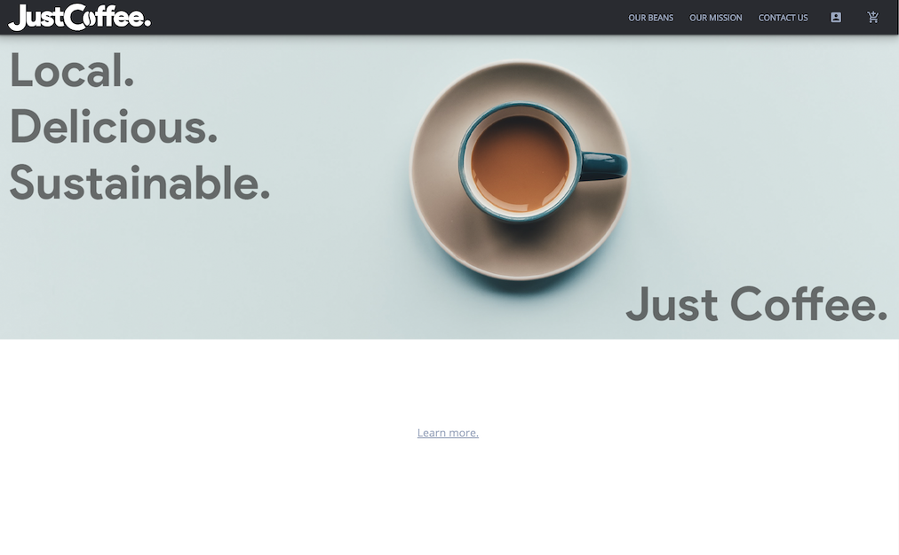

# Just Coffee

Table of Contents|
------------------|
Version|
Description|
Installation|
Usage|
Contributors|
Licensing|

## Version:
***

## Description:
***
Visit the deployed site here https://justcoffee.herokuapp.com/

A full stack web application created for a group project at Rice University Coding Bootcamp 2020.
Just Coffee is a subscription website with coffee as the example product/theme. 
The idea is to create an application that any product-based business could use to sell subscriptions to their customer base.
Features include modern css styling including animated scroll effects, dynamically generated html, user account creation, and an SQL databse.
Made with the MVC (model view controller) paradigm using Agile Development philosophy.

### Preview:

### Built with:

Node.js, Handlebars.js, Express.js, MySQL, Sequelize ORM, Passport npm, Bcrypt npm, AOS CSS Scroll Library, and Materialize CSS Framework

## Installation:
>

Please visit the live URL mentioned above.
>

## Usage:
***
Any business that would like to offer subscriptions to potential and existing customers.

## Contributors:

https://github.com/gravyhtx

https://github.com/Ghalileo

## Licensing:
***

## Creator:
***

## Contact:
***
robin.aguilar@gmail.com

